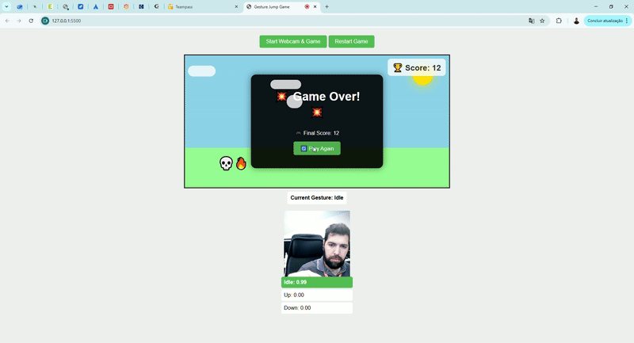

# tm-IntelligentGame

 

**Deep Learning Specialization — CIn UFPE (2025)**  
Intelligent control of the *Chrome Dino* game using multimodal signals: **gestures** and **sound**.




---

## Overview  
This project explores multimodal deep learning techniques to control an inspired game on *Chrome Dino* automatically using non-traditional inputs:  
- **Dino With Gesture** — control via webcam and body gestures.  
- **Dino With Sound** — control via audio triggers (e.g., clap to jump and shush to duck under).  

### Goals  
- Implement lightweight real-time vision and audio models.  
- Hands on project to get experience with problems in training and inference that happen on the real world.
- Have some fun while learning!  

---

## Key Features  
- Modular structure (one directory per control mode).  
- You can train your own model on Teachable Machine and plug and play!
- Real-time demo examples.  
- Defined evaluation metrics for player performance (survival time, number of sucessful jumps and visual feedback of inference).  

---

## Lessons Learned 
- Importance of augmentation (show the gesture near, far, slightly turned sideways, upward and so on and so forth)  
- Use of Claude Ai to accelerate development (I only did minor tweaks and troubleshooting)
- Got better gameplay experience with the gesture (probably due to latency on the audio version)  
- If categorization is showing wrongly, do retraining until it does right (only needed 2-3 retrainings) 

---

## Repository Structure  
```
.
├── README.md
├── requirements.txt
├── "Dino With Gesture"/
│   ├── index.html               
│   └── my_model/              
│       ├── weights.bin
│       ├── metadata.json
│       └── model.json
└── "Dino With Sound"/
    ├── index.html
    └── my_model/
        ├── weights.bin
        ├── metadata.json
        └── model.json

```

---

## Requirements  
I've used a vscode extension named Live Server, otherwise Chrome and other broswers would suspect the is malicious code.

---

## Quick Start — Inference (Demo)  
1. Clone the repository:  
   ```bash
   git clone https://github.com/auriliosantos/tm-IntelligentGame.git
   cd tm-IntelligentGame
   ```
2. Run the gesture demo:  
   ```
   serve the page index.html and autorize the usage of the camera
   ```
3. Run the sound demo:  
   ```
   serve the page index.html and autorize the usage of the microphone
   ```

---

## How to retrain for your need 
```
Open an image or sound project on Teachable Machine https://teachablemachine.withgoogle.com/ remember to train 3 classes, idle, Up (jump) and Down (duck)
```

Expected output:
- Download the zip file from the Teachable Machine site;
- Extract the files to `my_model/`;
- Go Jump some obstacles!

---

## Contributing  
1. Open an issue to suggest an idea or report a bug.  
2. Fork the repo and create a branch `feature/<name>`.  
3. Submit a pull request describing your changes.  
4. Keep `README.md`, `requirements.txt`, and `CHANGELOG.md` updated.  

---

## License  
This project is licensed under the **MIT License** — see the `LICENSE` file for details.

---

## Author  
**Aurílio Santos**  
[GitHub Profile](https://github.com/auriliosantos)

---

